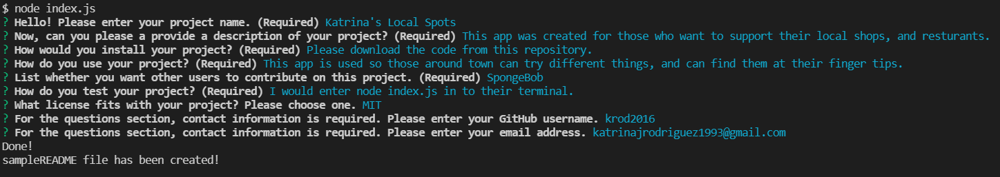

## README Generator

## Description
This app is to create a README for a project of your choosing.

Here is a screenshot of the terminal being used to create the README. To see a sample README, please see 'sampleREADME' in this repository.

## Technologies Used:
* Inqurier
* JavaScript
* Node.js

## Installation
* To use this app, please download the code from this repository.
* Next, please download inqurier to get the app working.

## Process
* First, I generated the markdown prompt for the readme.
* After testing, I created the sample README.

## Links
* GitHub: https://github.com/krod2016/readmeGenerator
* Video Walkthrough: https://drive.google.com/file/d/1F52wejmGG-0MD84acEUbnmEOcoj6SSKI/view

## Made By
Katrina Rodriguez